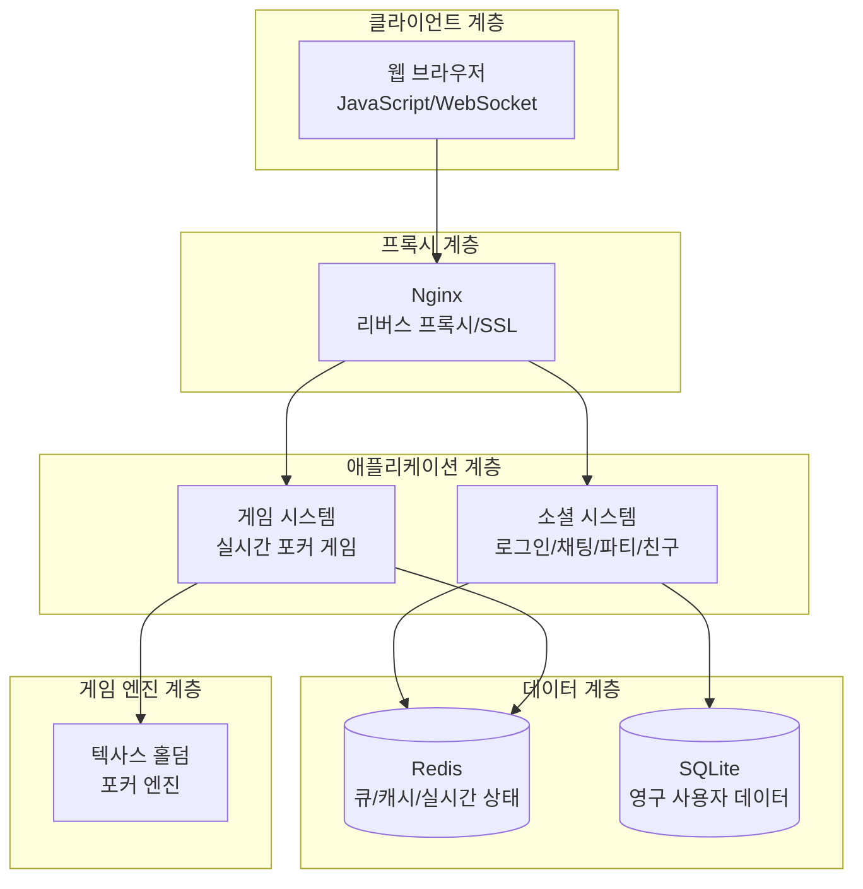
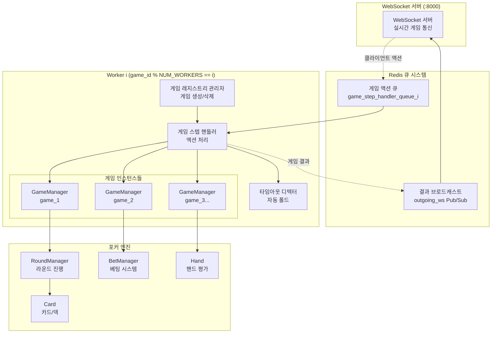
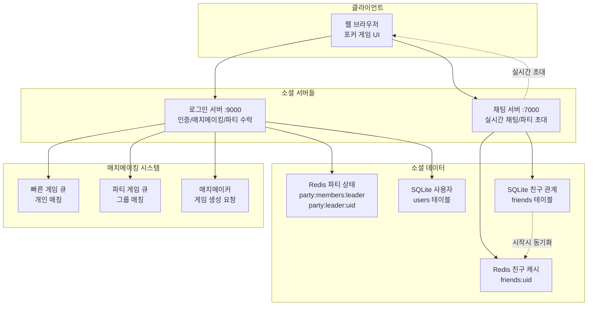
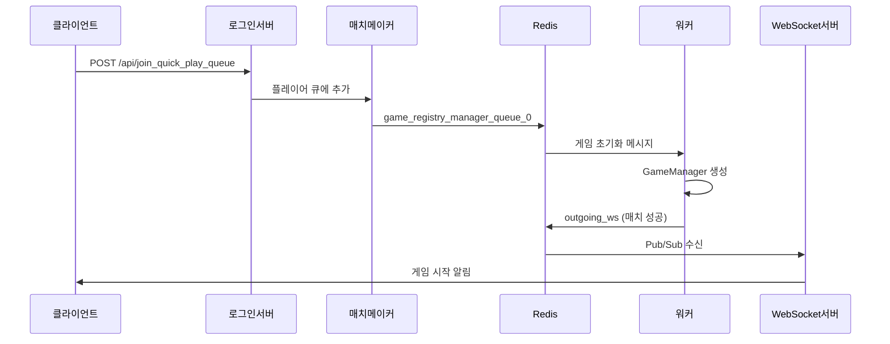
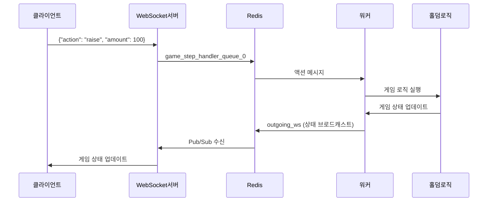

# HoldemArena 포커 플랫폼 아키텍처

## 프로젝트 개요

**HoldemArena**는 실시간 멀티플레이어 텍사스 홀덤 포커 게임 플랫폼입니다. 분산 워커 시스템과 웹 서버 계층을 분리한 이중 아키텍처로 설계되어 대규모 동시 게임 처리가 가능합니다.

## 전체 시스템 아키텍처 (High-Level)



### 상세 시스템 다이어그램

아래 다이어그램들은 각 계층의 내부 구조를 상세히 보여줍니다:
- [게임 워커 시스템](#게임-워커-시스템-상세)
- [소셜 시스템](#소셜-시스템-상세)

## 게임 워커 시스템 상세



## 소셜 시스템 상세



## 실행 구조

### 개발 환경
```bash
# 터미널 1: 웹 서버들 실행
python main.py all        # 모든 웹서버 동시 실행

# 터미널 2: 게임 워커들 실행
python worker_main.py     # NUM_WORKERS 개수만큼 워커 프로세스 생성
```

### 프로덕션 환경
```bash
# systemd 서비스로 관리
systemctl start holdemarena-workers   # 워커 먼저 시작
systemctl start holdemarena-login     # 웹서버들 시작
systemctl start holdemarena-websocket
systemctl start holdemarena-chat
```

## 핵심 컴포넌트

### 1. 웹 서버 계층 (사용자 대면)

#### 로그인 서버 (main.py login)
- **포트**: 9000
- **역할**: 인증, 파티 관리, 매치메이킹, 정적 파일 서빙
- **주요 엔드포인트**:
  ```
  POST /api/register          # 회원가입
  POST /api/login             # 로그인
  GET  /api/google_login      # Google OAuth
  POST /api/join_quick_play_queue  # 빠른 게임 큐 참가
  POST /api/party/invite      # 파티 초대
  ```

#### WebSocket 서버 (main.py ws)
- **포트**: 8000
- **역할**: 게임 액션 수신 및 상태 브로드캐스팅
- **메시지 흐름**:
  ```
  클라이언트 액션 → WebSocket 서버 → Redis 큐 → 워커
  워커 → Redis Pub/Sub → WebSocket 서버 → 클라이언트
  ```

#### 채팅 서버 (main.py chat)
- **포트**: 7000
- **역할**: 실시간 채팅, 파티 시스템
- **기능**: 로비 채팅, 게임 내 채팅, 파티 초대/관리

### 2. 게임 워커 계층 (게임 로직 처리)

#### 워커 분산 알고리즘
```python
# worker_main.py
worker_id = game_id % NUM_WORKERS
```
- 게임 ID 해시를 통한 일관된 워커 할당
- 같은 게임은 항상 같은 워커에서 처리
- 워커 간 상태 공유 없이 독립적 처리

#### 각 워커의 3-루프 구조

```python
# servers/worker.py
async def worker_main(i: int):
    await asyncio.gather(
        game_registry_manager_loop(i),
        game_step_handler_loop(i),
        game_timeout_detector_loop(i),
    )
```

##### 1. 게임 레지스트리 관리자 (`game_registry_manager_loop`)
- **큐**: `game_registry_manager_queue_{i}`
- **역할**: 게임 생성 및 삭제
- **처리 메시지**:
  ```json
  {
    "type": "init",
    "body": {
      "game_id": "abc123",
      "game_type": "quick_play",
      "uids": ["uid1", "uid2"],
      "player_ids": ["p1", "p2"],
      "room_settings": {
        "chips": [2000, 2000],
        "sb": 1, "bb": 2,
        "base_time": 15.0,
        "timebank": 30.0
      }
    }
  }
  ```
- **동작**:
  1. GameManager 인스턴스 생성
  2. `game_registry[game_id]`에 등록
  3. Redis에 게임-유저 매핑 저장
  4. `game_step_handler_queue_{i}`로 초기화 메시지 전송

##### 2. 게임 스텝 핸들러 (`game_step_handler_loop`)
- **큐**: `game_step_handler_queue_{i}`
- **역할**: 실제 게임 로직 실행
- **처리 메시지**:
  ```json
  {
    "type": "action",
    "game_id": "abc123",
    "player_id": "p1",
    "action": "raise",
    "amount": 40,
    "action_count": 17,
    "received_at": 1748021321.53
  }
  ```
- **동작**:
  1. `game_registry`에서 GameManager 조회
  2. 홀덤 로직 엔진에서 액션 처리
  3. 게임 상태 업데이트
  4. `outgoing_ws` 큐로 결과 전송

##### 3. 게임 타임아웃 디텍터 (`game_timeout_detector_loop`)
- **큐**: `game_timeout_detector_queue_{i}`
- **역할**: 플레이어 타임아웃 감지
- **데이터 구조**: SortedList로 데드라인 관리
- **동작**:
  1. 게임별 타임아웃 시간 추적
  2. 데드라인 도달 시 자동 폴드 액션 생성
  3. `game_step_handler_queue_{i}`로 액션 전송

### 3. 데이터 계층

#### Redis 큐 시스템
```
# 워커별 처리 큐 (BLPOP/RPUSH)
game_registry_manager_queue_0    # 게임 생성/삭제
game_registry_manager_queue_1
...
game_step_handler_queue_0        # 게임 액션 처리
game_step_handler_queue_1
...
game_timeout_detector_queue_0    # 타임아웃 감지
game_timeout_detector_queue_1
...

# 브로드캐스트 큐 (Pub/Sub)
outgoing_ws                      # WebSocket 클라이언트로 전송
```

#### Redis 캐시 데이터
```
# 게임-유저 매핑
user:{uid}:game                     # 유저의 현재 게임 ID
game:{game_id}:player:{pid}:uid     # 플레이어-유저 매핑

# 파티 시스템 (Redis)
party:members:{leader_uid}          # 파티 멤버 Set
party:leader:{uid}                  # 각 유저의 파티장 UID
party:in_queue:{leader_uid}         # 파티의 매치메이킹 큐 상태

# 친구 시스템 (Redis 캐시)
friends:{uid}                       # 친구 목록 Set

# 매치메이킹 큐
queue:quick_play                    # 빠른 게임 대기 큐
```

#### SQLite 영구 저장소
- **users**: 사용자 기본 정보 (uid, username, provider, provider_id)
- **game_history**: 게임 결과 기록 (game_id, uid, result, chips_change)
- **friends**: 친구 관계 (uid1, uid2) - uid1 < uid2 정규화

### 4. 홀덤 로직 엔진

#### 게임 매니저 (`app/services/game_manager.py`)
```python
class GameManager:
    def __init__(self, game_id, game_type, uids, player_ids, chips, sb=1, bb=2):
        self.round_manager = RoundManager(chips, sb, bb)
        self.player_ids = player_ids
        self.uids = uids

    async def player_action(self, player_id, action, amount=0):
        # 1. 액션 유효성 검사
        # 2. RoundManager에 액션 적용
        # 3. 게임 상태 업데이트
        # 4. 결과 브로드캐스트
```

#### 홀덤 코어 (`holdemlogic/`)
```
holdemlogic/
├── card.py           # Card, Deck 클래스
├── hand.py           # Hand, HandRanking 클래스
├── bet_manager.py    # BetManager 클래스
└── round_manager.py  # RoundManager 클래스
```

## 메시지 플로우

### 게임 시작 플로우


### 게임 액션 플로우


## 확장성 설계

### 수평 확장
1. **워커 확장**: `NUM_WORKERS` 증가로 게임 처리 능력 증가
2. **웹서버 확장**: 각 서비스별 다중 인스턴스 + Nginx 로드밸런싱 (향후 확장)
3. **Redis 확장**: Redis Cluster로 큐 시스템 분산

### 성능 최적화
- **게임 ID 해싱**: 캐시 친화적 워커 할당
- **비동기 3-루프**: 병렬 처리로 높은 처리량
- **무상태 워커**: 워커 간 동기화 오버헤드 없음
- **Redis Pub/Sub**: 실시간 브로드캐스트

## 디렉토리 구조

```
/root/th/
├── main.py                        # 웹서버 실행 (login|ws|chat|all)
├── worker_main.py                 # 워커 실행 (멀티프로세스)
├── .env                          # 환경설정 (NUM_WORKERS, 포트 등)
│
├── app/                          # 웹서버 애플리케이션
│   ├── network/
│   │   ├── websocket_server.py   # 게임 WebSocket 서버 (:8000)
│   │   └── chat_server.py        # 채팅 서버 (:7000)
│   ├── routes/
│   │   └── login_server.py       # 로그인/API 서버 (:9000)
│   ├── services/
│   │   ├── game_manager.py       # 게임 세션 관리
│   │   ├── matchmaker.py         # 매치메이킹 로직
│   │   ├── party_manager.py      # 파티 시스템
│   │   └── messaging.py          # Redis 메시징
│   └── protocol/
│       └── message_models.py     # Pydantic 메시지 모델
│
├── servers/                      # 워커 시스템
│   ├── worker.py                 # 워커 메인 (3-루프 실행)
│   ├── game_registry_manager.py  # 게임 생성/삭제
│   ├── game_step_handler.py      # 게임 액션 처리
│   ├── game_timeout_detector.py  # 타임아웃 감지
│   ├── registry.py               # 전역 game_registry dict
│   └── logs/                     # 워커별 로그 파일
│
├── holdemlogic/                  # 포커 게임 엔진
│   ├── card.py                   # 카드/덱 시스템
│   ├── hand.py                   # 핸드 평가/랭킹
│   ├── bet_manager.py            # 베팅 시스템
│   └── round_manager.py          # 라운드 관리
│
└── users.db                      # SQLite 사용자 DB
```

## 파티 및 친구 시스템

### 파티 시스템 플로우

#### 1. 파티 초대 (채팅 서버)
```python
# POST /api/party/invite
inviter_uid = get_uid_from_token(token)
invitee_uid = get_uid_by_username(req.username)
leader = await get_party_leader(inviter_uid)

# 실시간 초대 알림 전송
await invitee_ws.send_json({
    "type": "party_invite",
    "from_uid": inviter_uid,
    "from_username": get_username_by_uid(inviter_uid),
    "leader_uid": leader
})
```

#### 2. 파티 수락 (로그인 서버)
```python
# POST /api/party/accept
await accept_invite(uid, req.leader_uid)

# Redis 상태 업데이트
await redis.sadd(f"party:members:{leader_uid}", uid)
await redis.set(f"party:leader:{uid}", leader_uid)
await broadcast_party_status(leader_uid)  # 모든 파티원에게 알림
```

#### 3. 파티 매치메이킹
```python
# 파티 큐 등록
await set_party_in_queue(leader_uid, True)
members = await get_party_members(leader_uid)

# 매치메이킹 처리
if len(members) >= 2:
    await create_party_game(leader_uid, members)
```

### 친구 시스템

#### 1. 친구 목록 조회 (로그인 서버)
```python
# GET /api/friends
cursor.execute("""
    SELECT uid1, uid2 FROM friends
    WHERE uid1 = ? OR uid2 = ?
""", (uid, uid))

# uid1 < uid2 정규화된 저장 방식
friend_uid = uid2 if uid == uid1 else uid1
```

#### 2. 친구 데이터 캐싱 (채팅 서버)
```python
# 서버 시작 시 SQLite → Redis 동기화
for uid1, uid2 in rows:
    await redis.sadd(f"friends:{uid1}", uid2)
    await redis.sadd(f"friends:{uid2}", uid1)
```

## 기술 스택

### 분산 시스템
- **큐 시스템**: Redis Lists (BLPOP/RPUSH)
- **워커 분산**: Consistent Hashing (`game_id % workers`)
- **상태 동기화**: Redis Pub/Sub + 워커별 game_registry
- **프로세스 관리**: Python multiprocessing

### 웹 기술
- **Framework**: FastAPI (Python)
- **WebSocket**: FastAPI WebSocket + uvicorn
- **Database**: SQLite (영구), Redis (캐시/큐)
- **Authentication**: JWT + Google OAuth2

### 인프라
- **Reverse Proxy**: Nginx (SSL 종료, 라우팅, 프록시)
- **Process Manager**: systemd (프로덕션)
- **Monitoring**: journalctl, 워커별 로그 파일

## 아키텍처 장점

### 1. 관심사 분리
- **웹 계층**: 사용자 인터페이스, 인증, 실시간 통신
- **워커 계층**: 순수 게임 로직, 분산 처리
- **데이터 계층**: 영구 저장, 캐시, 메시지 큐

### 2. 확장성
- **독립적 확장**: 웹서버와 워커를 별도로 스케일링
- **수평 확장**: 워커 수 증가로 게임 처리 능력 선형 증가
- **무상태 설계**: 워커 간 의존성 없음

### 3. 안정성
- **장애 격리**: 한 워커 장애가 다른 게임에 영향 없음
- **자동 복구**: systemd 자동 재시작
- **타임아웃 처리**: 무응답 플레이어 자동 처리

### 4. 실시간 성능
- **비동기 처리**: 3-루프 병렬 구조로 높은 처리량
- **Redis 큐**: 마이크로초 단위 메시지 전달
- **WebSocket**: 실시간 양방향 통신
