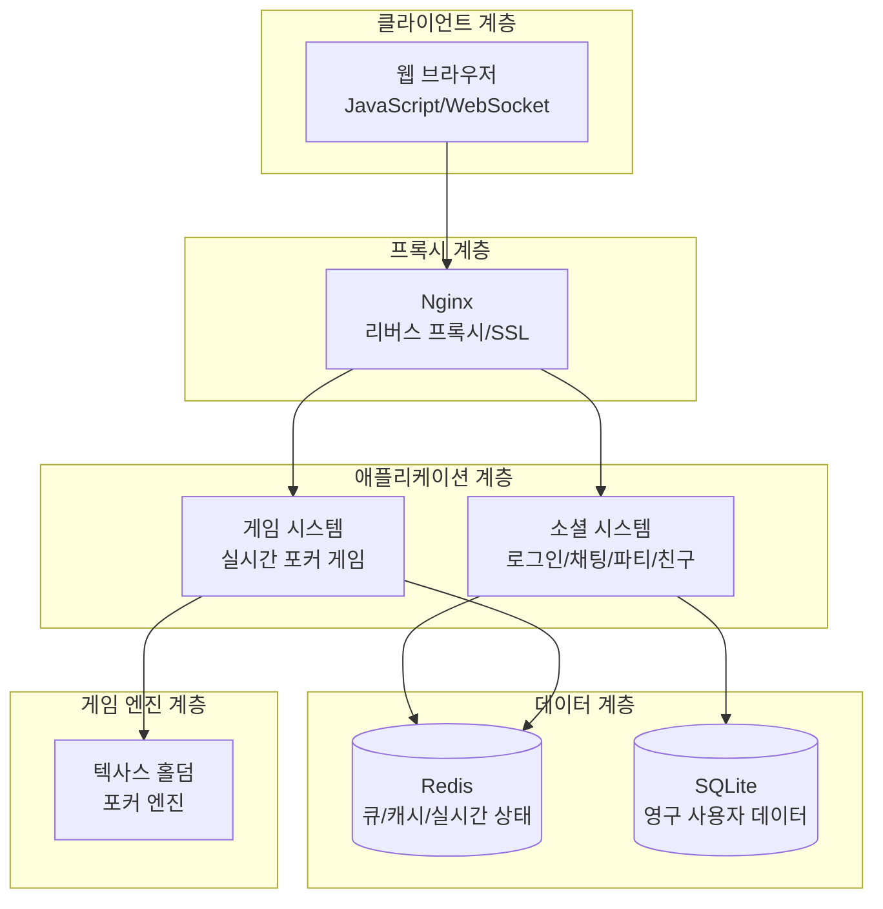
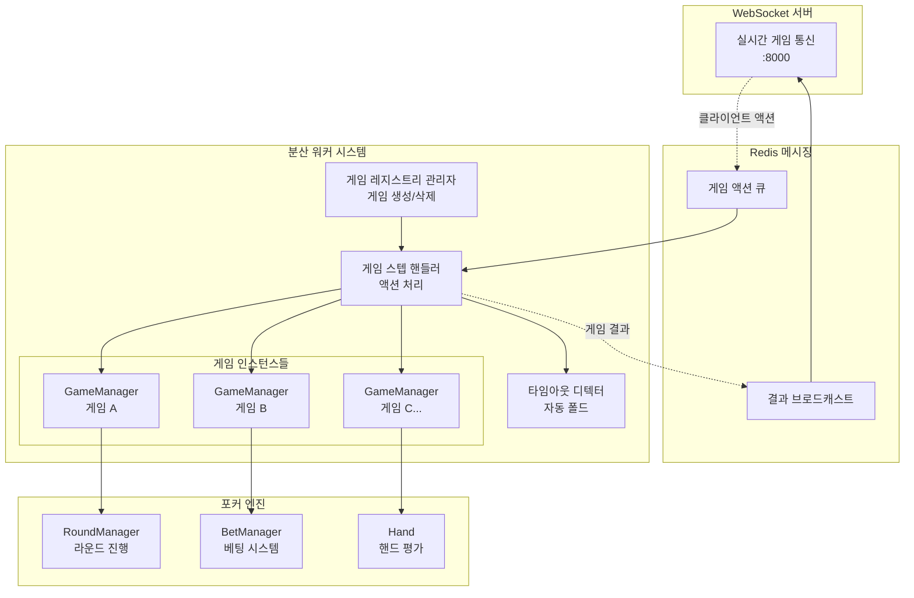
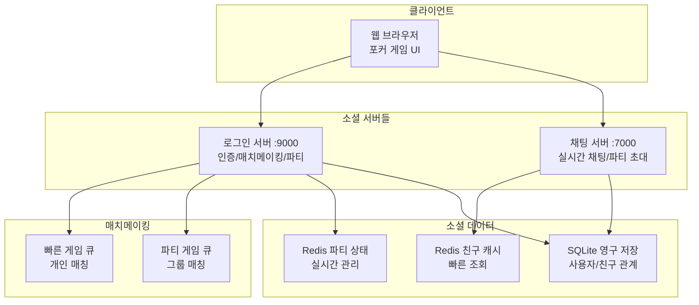

# HoldemArena - 실시간 멀티플레이어 포커 플랫폼

## 프로젝트 개요

### 개발 동기
군 복무 중 텍사스 홀덤을 접하게 되면서 그 전략적 재미에 매료되었습니다. 전역 후 온라인으로 홀덤을 즐기려고 찾아보니, 기존 서비스들은 대부분 사행성에 치우쳐져 있거나 게임 품질이 아쉬웠습니다.

리그 오브 레전드의 아레나 모드처럼, 순수하게 스포츠로서의 홀덤을 즐길 수 있는 플랫폼이 있으면 좋겠다는 생각에서 HoldemArena 프로젝트를 시작하게 되었습니다.

### 프로젝트 목표
- 💰 **사행성 배제**: 칩은 게임 내에서만 의미를 가지며, 현금 거래 없음
- 🎯 **스포츠적 경쟁**: 실력 기반의 순수한 포커 게임 환경
- 👥 **소셜 기능**: 친구와 함께 즐길 수 있는 파티 시스템
- ⚡ **고품질 경험**: 실시간 반응성과 안정적인 게임 진행

### 기술적 특징
**HoldemArena**는 실시간 멀티플레이어 텍사스 홀덤 포커 게임 플랫폼입니다. 분산 워커 시스템과 웹 서버 계층을 분리한 이중 아키텍처로 설계되어 대규모 동시 게임 처리가 가능합니다.

## 시스템 아키텍처

### 전체 시스템 구조



### 게임 워커 시스템



### 소셜 시스템



## 핵심 기술적 특징

### 1. 분산 워커 시스템
- **게임 ID 기반 분산**: `game_id % NUM_WORKERS`로 일관된 워커 할당
- **3-루프 아키텍처**: 각 워커에서 게임 관리, 액션 처리, 타임아웃 감지가 병렬 실행
- **독립적 게임 관리**: 워커별로 여러 게임을 동시 처리

```python
# 워커 분산 알고리즘
worker_id = game_id % NUM_WORKERS

# 3-루프 병렬 실행
await asyncio.gather(
    game_registry_manager_loop(i),    # 게임 생성/삭제
    game_step_handler_loop(i),        # 게임 액션 처리
    game_timeout_detector_loop(i),    # 타임아웃 감지
)
```

### 2. 실시간 통신 시스템
- **WebSocket 양방향 통신**: 클라이언트와 서버 간 즉시 상태 동기화
- **Redis Pub/Sub**: 워커에서 WebSocket 서버로 게임 결과 브로드캐스트
- **Redis 큐**: 클라이언트 액션을 워커에게 안정적 전달

### 3. 완전한 포커 게임 엔진
- **텍사스 홀덤 구현**: 프리플랍부터 리버까지 완전한 게임 플로우
- **핸드 평가 시스템**: 7장 중 최고 5장 조합 자동 선택
- **베팅 시스템**: 포지션별 액션 순서와 사이드팟 계산
- **타임뱅크**: 플레이어별 시간 관리 및 자동 타임아웃 처리

```python
# 핸드 평가 예시
def evaluate_hand(self) -> tuple:
    best_rank = -1
    best_hand = None
    # 7장 중 5장 조합 모두 확인
    for combo in combinations(self.cards, 5):
        rank = self.classify_hand(combo)
        if best_rank < rank:
            best_rank = rank
            best_hand = combo
    return best_rank, sorted(best_hand, reverse=True)
```

### 4. 파티 및 친구 시스템
- **실시간 파티 초대**: WebSocket을 통한 즉시 알림
- **파티 매치메이킹**: 그룹 단위 게임 생성
- **친구 관리**: SQLite 영구 저장 + Redis 캐싱으로 빠른 조회

## 기술 스택

### Backend
- **Python 3.x** + **FastAPI**: 고성능 비동기 웹 프레임워크
- **Redis**: 메시지 큐, 캐시, Pub/Sub 시스템
- **SQLite**: 사용자 데이터 영구 저장
- **WebSocket**: 실시간 양방향 통신
- **JWT**: 상태 없는 인증 시스템

### Frontend
- **HTML5/CSS3/JavaScript**: 순수 웹 기술로 포커 게임 UI 구현
- **WebSocket API**: 실시간 게임 상태 동기화

### Infrastructure
- **Nginx**: 리버스 프록시 및 SSL 종료
- **multiprocessing**: 워커 프로세스 분산 실행

## 데이터 모델

### Redis 키 구조
```
# 게임 상태
user:uid:game                    # 유저의 현재 게임 ID
game:game_id:player:pid:uid      # 플레이어-유저 매핑

# 파티 시스템
party:members:leader_uid         # 파티 멤버 Set
party:leader:uid                 # 각 유저의 파티장 UID
party:in_queue:leader_uid        # 파티 매치메이킹 상태

# 워커 큐
game_registry_manager_queue_i    # 게임 생성/삭제 큐
game_step_handler_queue_i        # 게임 액션 처리 큐
outgoing_ws                      # WebSocket 브로드캐스트
```

### SQLite 스키마
- **users**: 사용자 기본 정보 (uid, username, provider)
- **friends**: 친구 관계 (uid1, uid2)
- **game_history**: 게임 결과 기록

## 시스템 특징

### 확장성
- **수평 확장**: 워커 수 증가로 게임 처리 능력 선형 확장
- **무상태 설계**: 워커 간 의존성 없이 독립적 확장
- **분산 처리**: 게임별 독립적 처리로 장애 격리

### 성능
- **비동기 처리**: asyncio 기반 동시 처리
- **Redis 큐**: 마이크로초 단위 메시지 전달
- **메모리 효율**: 워커별 독립적 게임 상태 관리

### 안정성
- **장애 격리**: 한 워커 장애가 다른 게임에 영향 없음
- **타임아웃 처리**: 무응답 플레이어 자동 처리
- **예외 처리**: 각 워커 루프의 독립적 에러 핸들링