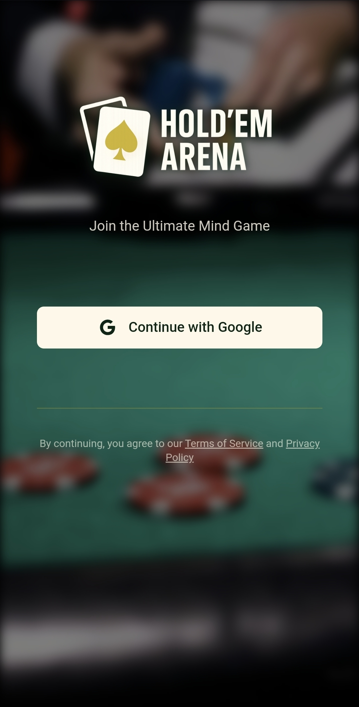
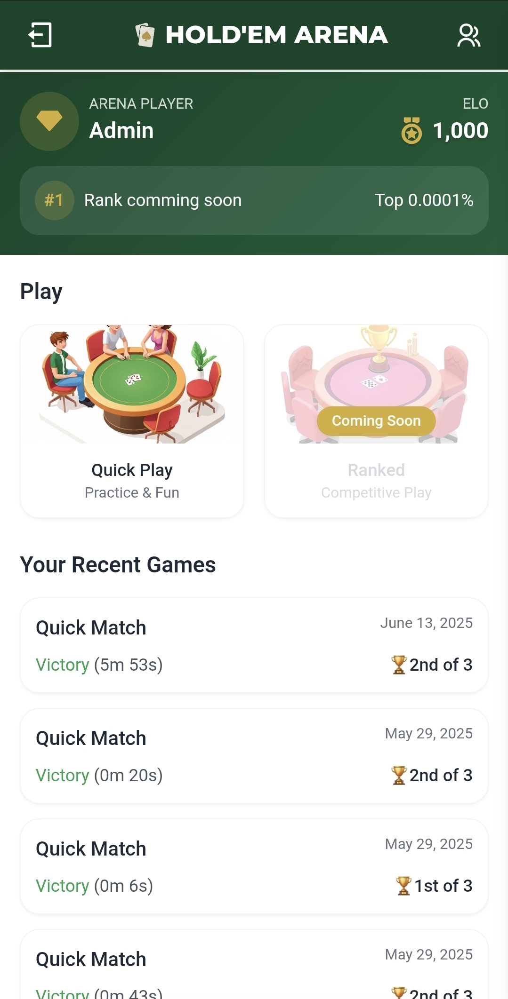
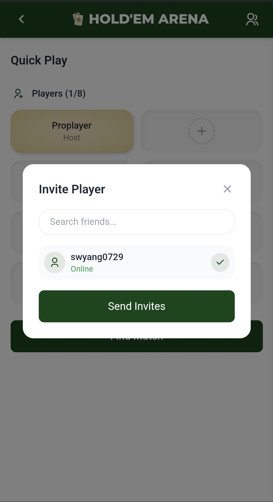
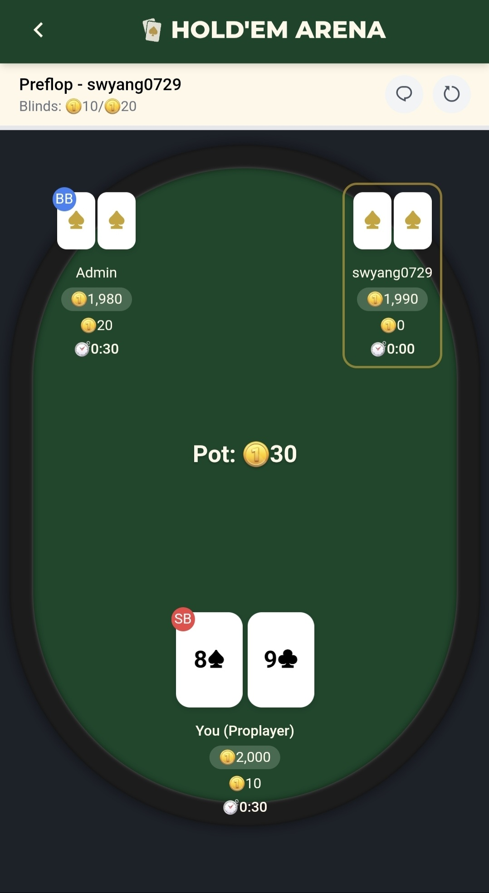
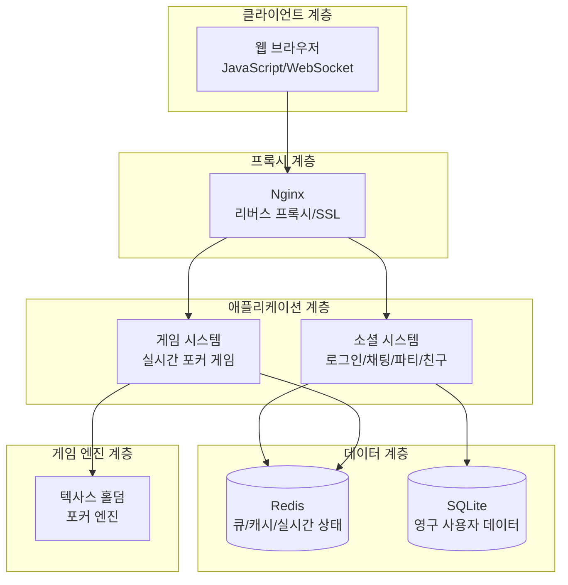

# HoldemArena - 온라인 텍사스 홀덤 포커

실시간 멀티플레이어 텍사스 홀덤 포커 게임 플랫폼입니다.

## 🎮 라이브 데모

**[holdemarena.win](https://holdemarena.win)** 에서 실제 게임을 플레이할 수 있습니다!

- 회원가입 후 바로 게임 참여 가능
- 친구와 파티 게임 또는 빠른 매치메이킹
- 실시간 채팅 및 소셜 기능 체험

## 📱 게임 스크린샷

<table>
  <tr>
    <td align="center">
      
      <br><b>Google OAuth 로그인</b>
    </td>
    <td align="center">
      
      <br><b>메인 로비 & 게임 히스토리</b>
    </td>
  </tr>
  <tr>
    <td align="center">
      
      <br><b>친구 초대 & 파티 시스템</b>
    </td>
    <td align="center">
      
      <br><b>실시간 포커 게임</b>
    </td>
  </tr>
</table>

## 프로젝트 개요

### 개발 동기
군 복무 중 텍사스 홀덤을 접하게 되면서 그 전략적 재미에 매료되었습니다. 전역 후 온라인으로 홀덤을 즐기려고 찾아보니, 기존 서비스들은 대부분 사행성에 치우쳐져 있거나 게임 품질이 아쉬웠습니다.

리그 오브 레전드의 아레나 모드처럼, 순수하게 스포츠로서의 홀덤을 즐길 수 있는 플랫폼이 있으면 좋겠다는 생각에서 HoldemArena 프로젝트를 시작하게 되었습니다.

### 기술적 특징
텍사스 홀덤 포커의 완전한 규칙을 구현한 웹 기반 게임으로, 여러 플레이어가 동시에 실시간으로 게임을 즐길 수 있습니다.

## 시스템 아키텍처



## 주요 기능

- **실시간 멀티플레이어 게임**: WebSocket을 통한 실시간 게임 진행
- **완전한 포커 게임 엔진**: 텍사스 홀덤의 모든 규칙 구현
- **사용자 시스템**: 회원가입/로그인, Google OAuth 지원
- **파티 시스템**: 친구 초대 및 그룹 게임
- **매치메이킹**: 빠른 게임 참가 시스템
- **실시간 채팅**: 로비 및 게임 내 채팅
- **타임뱅크 시스템**: 플레이어별 시간 관리

## 기술 스택

### Backend
- **Python 3.x** - 메인 언어
- **FastAPI** - 웹 프레임워크 (3개 서버)
- **Redis** - 메시지 큐 및 캐시
- **SQLite** - 사용자 데이터 저장
- **WebSocket** - 실시간 통신
- **JWT** - 인증 시스템
- **uvicorn** - ASGI 서버

### Frontend
- **HTML5/CSS3/JavaScript** - 웹 클라이언트
- **WebSocket API** - 실시간 게임 통신

### Infrastructure
- **Nginx** - 리버스 프록시 및 SSL 종료
- **Redis** - 메시지 큐 시스템
- **systemd** - 프로세스 관리

## 아키텍처

시스템은 두 개의 주요 계층으로 구성됩니다:

### 웹 서버 계층 (사용자 대면)
- **로그인 서버** (`:9000`) - 인증, 파티 관리, 매치메이킹
- **WebSocket 서버** (`:8000`) - 실시간 게임 통신
- **채팅 서버** (`:7000`) - 실시간 채팅

### 게임 워커 계층 (게임 로직 처리)
- **게임 레지스트리 관리자** - 게임 생성/삭제
- **게임 스텝 핸들러** - 실제 게임 로직 실행
- **타임아웃 디텍터** - 플레이어 타임아웃 관리

### 분산 처리
- 게임 ID 해시 기반 워커 분산 (`game_id % NUM_WORKERS`)
- Redis 큐를 통한 비동기 메시지 전달
- 워커별 독립적 게임 상태 관리

## 실행 방법

### 환경 설정
```bash
# 가상환경 생성 및 활성화
python -m venv venv
source venv/bin/activate  # Linux/Mac
# venv\Scripts\activate   # Windows

# 의존성 설치
pip install -r requirements.txt

# 환경 변수 설정
cp .env.example .env  # .env 파일 수정 필요
```

### 개발 환경 실행
```bash
# 터미널 1: 웹 서버들 실행
python main.py all

# 터미널 2: 게임 워커들 실행
python worker_main.py
```

### 개별 서버 실행
```bash
python main.py login    # 로그인 서버만
python main.py ws       # WebSocket 서버만
python main.py chat     # 채팅 서버만
```

## 환경 변수

`.env` 파일에서 다음 설정이 필요합니다:

```env
# 서버 포트
PORT=9000
WS_PORT=8000
CHAT_PORT=7000

# 워커 설정
NUM_WORKERS=4

# JWT 설정
SECRET_KEY=your-secret-key
ALGORITHM=HS256

# Google OAuth (선택사항)
GOOGLE_CLIENT_ID=your-client-id
GOOGLE_CLIENT_SECRET=your-client-secret
```

## 프로젝트 구조

```
root/
├── main.py                    # 웹서버 실행
├── worker_main.py             # 워커 실행
├── app/                       # 웹서버 애플리케이션
│   ├── network/              # WebSocket 서버들
│   ├── routes/               # REST API
│   ├── services/             # 비즈니스 로직
│   └── static/               # 프론트엔드 파일
├── servers/                   # 게임 워커 시스템
│   ├── worker.py             # 워커 메인
│   ├── game_registry_manager.py
│   ├── game_step_handler.py
│   └── game_timeout_detector.py
├── holdemlogic/              # 포커 게임 엔진
│   ├── card.py               # 카드 시스템
│   ├── hand.py               # 핸드 평가
│   ├── bet_manager.py        # 베팅 시스템
│   └── round_manager.py      # 라운드 관리
└── users.db                  # SQLite 데이터베이스
```

## 게임 엔진 특징

### 포커 로직
- 완전한 텍사스 홀덤 규칙 구현
- 7장 중 최고 5장 조합 자동 선택
- 사이드팟 계산 지원
- 정확한 핸드 랭킹 시스템

### 실시간 처리
- WebSocket 기반 즉시 상태 동기화
- Redis Pub/Sub를 통한 브로드캐스팅
- 타임뱅크 및 자동 타임아웃 처리

### 확장성
- 워커 수 조정으로 게임 처리 능력 확장
- 게임별 독립적 처리 (장애 격리)
- 무상태 워커 설계

## 개발 정보

- **언어**: Python, JavaScript, HTML/CSS
- **코드 규모**: **총 10,752줄**
  - 🐍 **Python 45.6%** (4,899줄) - 백엔드 서버, 게임 엔진, 워커 시스템
  - 🌐 **JavaScript 34.2%** (3,682줄) - 실시간 게임 UI, 채팅, 매치메이킹
  - 📄 **HTML/CSS 20.2%** (2,171줄) - 웹 인터페이스, 로비, 게임 화면
- **문서**: 상세 아키텍처 및 API 문서 포함

## 추가 문서

- [ARCHITECTURE.md](ARCHITECTURE.md) - 시스템 아키텍처 상세 설명
- [API_REFERENCE.md](API_REFERENCE.md) - REST API 및 WebSocket 프로토콜

## 라이선스

이 프로젝트는 개인 포트폴리오 목적으로 제작되었습니다.